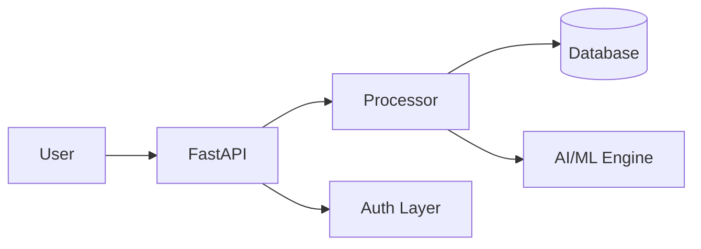

# Kirov Central Hub 🌐

The centralized access portal for the entire Kirov Dynamics AI and Cybersecurity ecosystem.

This single-page application makes it easy for users to discover, access, and utilize the tools we have built. 

## Features
- Fully responsive modern UI
- Direct links to active projects
- Funding-ready standby indicators

## Architecture

Microservices-based architecture with API Gateway, authentication layer, PostgreSQL persistence, and event-driven communication.

